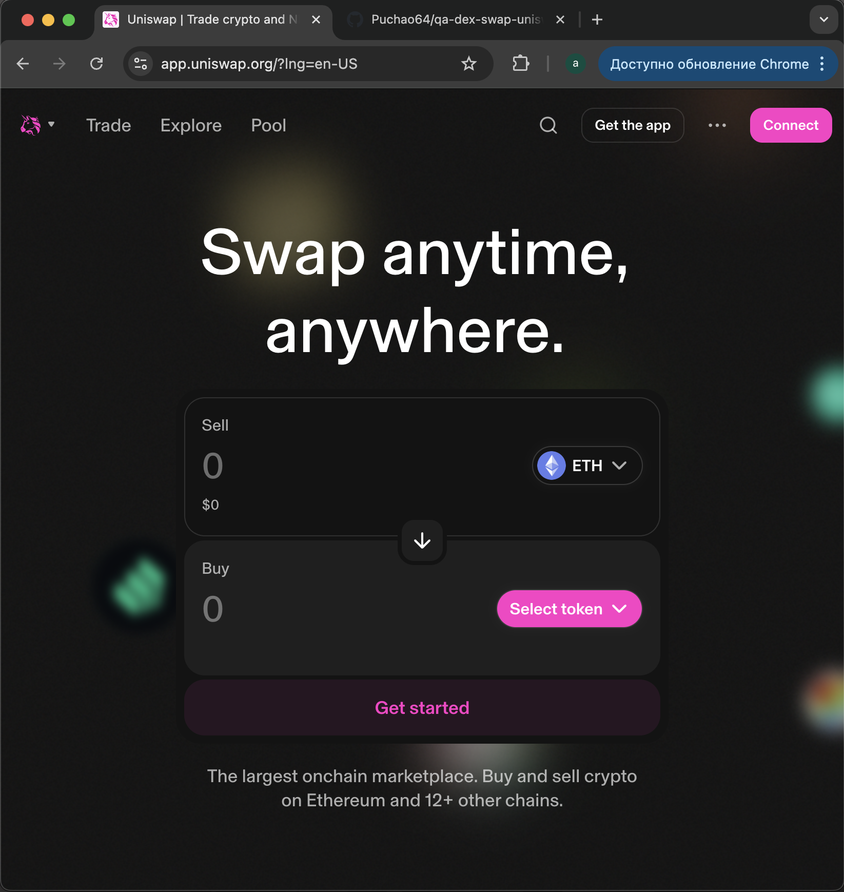
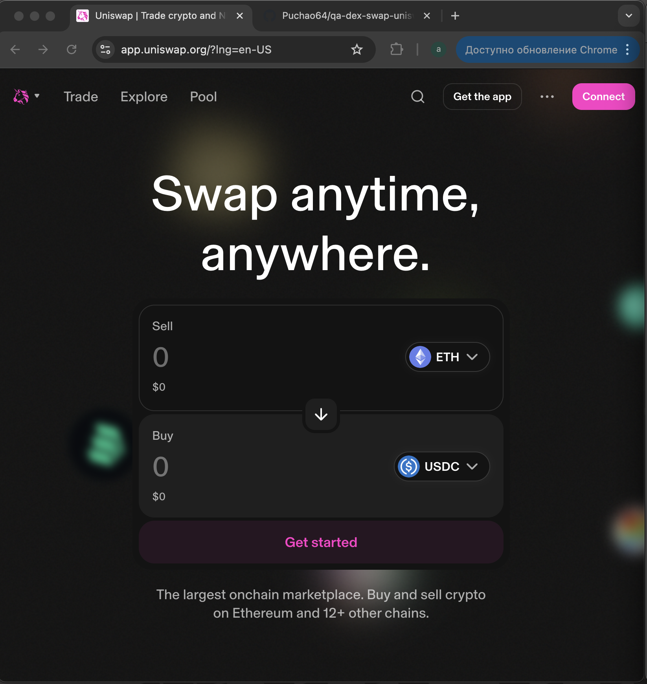
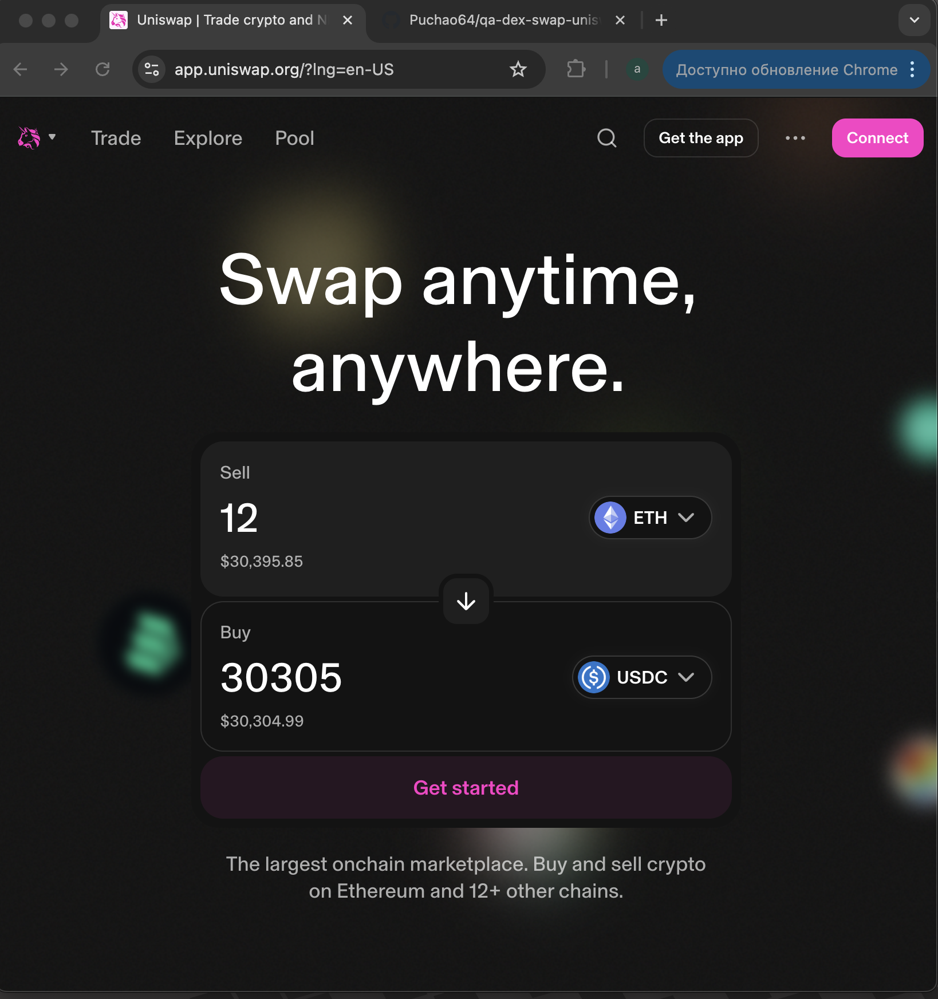
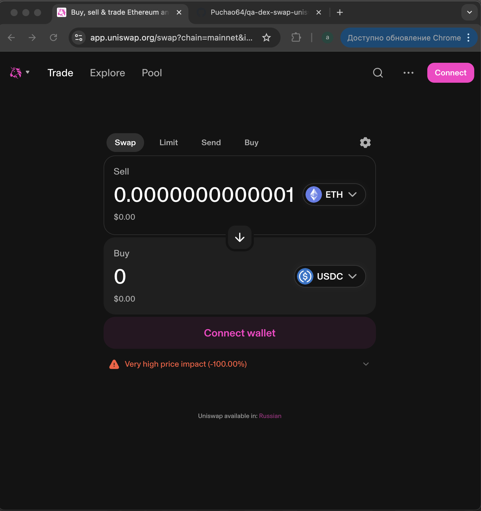
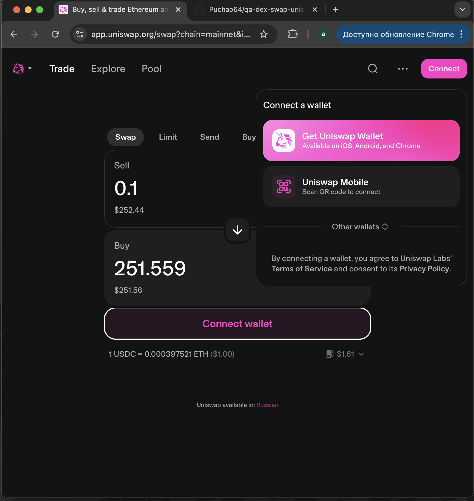
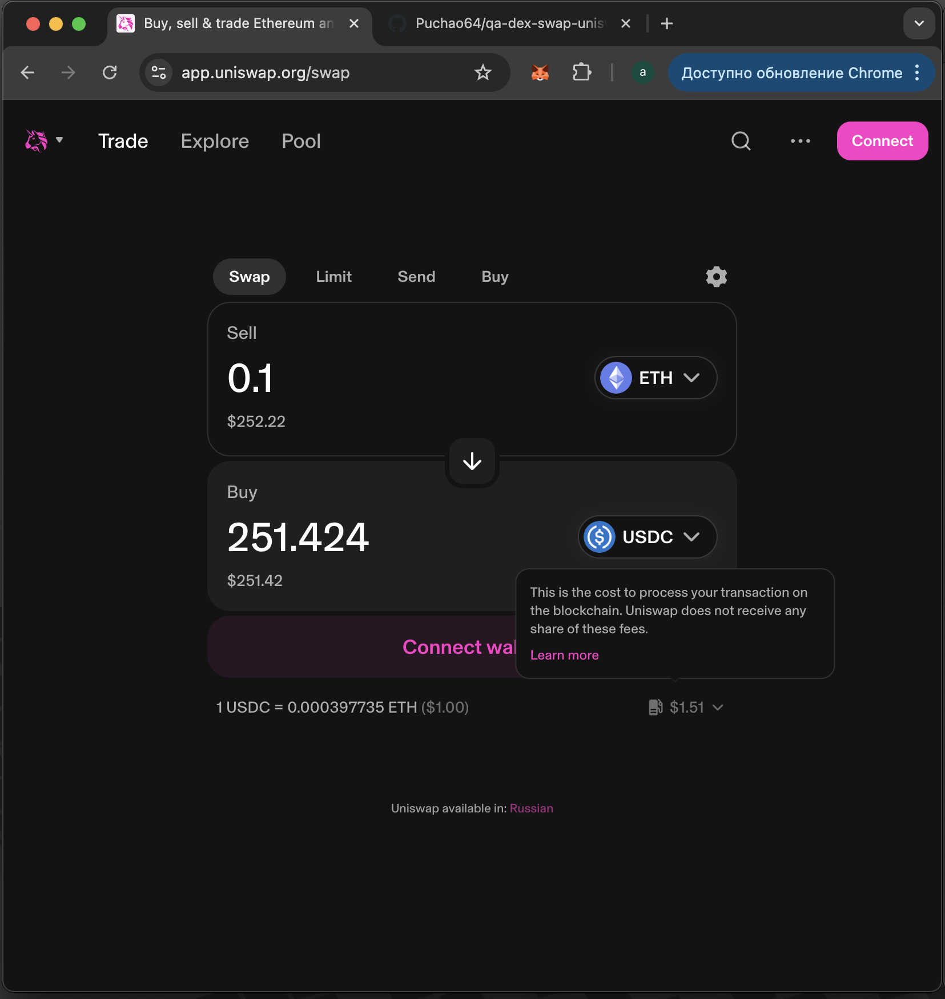
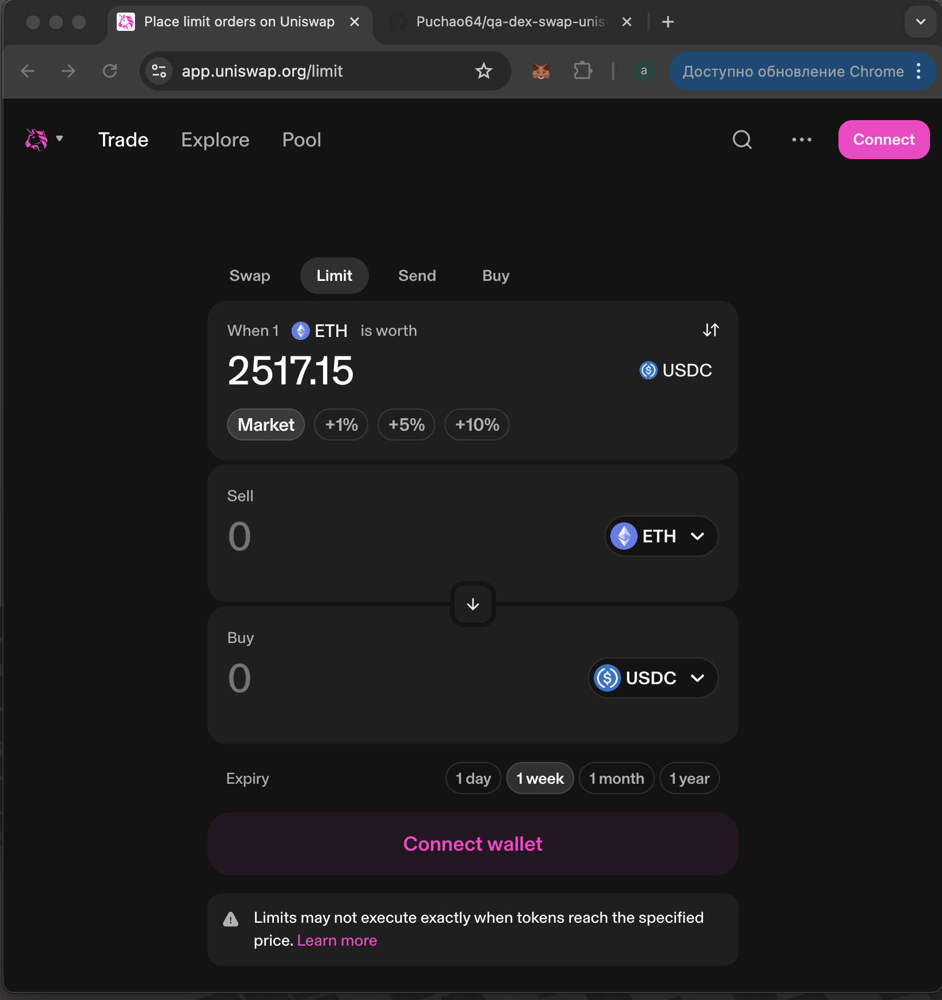

# 🧪 Manual QA Test: Uniswap DEX Swap Interface

This repository contains a structured QA case focused on manual testing of the token swap interface at [Uniswap](https://app.uniswap.org/#/swap). The goal was to validate UI behavior, error handling, and edge cases for swapping tokens without connecting a wallet.

---

## 🎯 Test Objectives

- Ensure proper rendering of the swap interface.
- Validate token selector functionality.
- Confirm correct error responses on invalid or zero amounts.
- Observe UI feedback on hover elements (gas fees, rate).
- Test swap action rejection when wallet is not connected.
- Capture fallback behavior such as swap cancellation (e.g. switching tabs).

---

## 🖼 Screenshots

| Step | Action                                   | Screenshot |
|------|------------------------------------------|------------|
| 1    | Open Uniswap                             |  |
| 2    | Select token (e.g. USDC)                 |  |
| 3    | Enter amount                             |  |
| 4    | Enter invalid amount (`0.000...01`)      |  |
| 5    | Attempt swap without wallet              |  |
| 6    | Hover over gas info / rate               |  |
| 7    | Cancel or exit swap (via Limit tab)      |  |

---

## ⚙️ Environment

- **Browser**: Chrome
- **Network**: Mainnet (Uniswap default)
- **Wallets**: Not connected (intended)
- **Language**: English UI
- **Tools**: Manual screenshots, mouse-based interaction

---

## ✅ Result

All UI behaviors function as expected for a disconnected user.  
Errors are triggered properly for invalid input, hover tooltips display contextual help, and the interface prevents unauthorized swaps.

Uniswap's DEX frontend demonstrates a robust and intuitive UI that handles edge cases gracefully.
